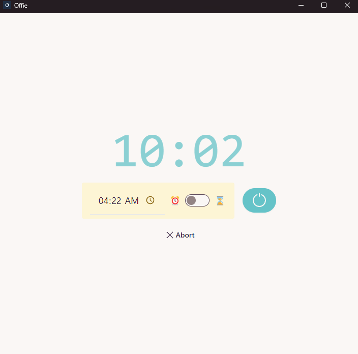

# Offie

## Overview

Offie is an application designed to provide a simple and efficient way to shut down your computer. It features a user-friendly interface built with DaisyUI components, ensuring a visually appealing and consistent design.

## Features

Offie offers two convenient shutdown modes:

-   **Time-based shutdown** - Schedule shutdown at a specific time
-   **Delay-based shutdown** - Set a countdown timer for shutdown after a specified duration

The application displays the current time and provides intuitive controls for managing your scheduled shutdown.

## Installation

To download and set up Offie, navigate to the Releases section in Github and run the Setup.exe installer.

## License

This project is licensed under the MIT License - see the LICENSE file for details.
